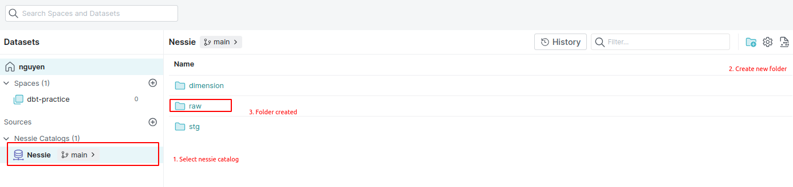

## Overview
This guide provides instructions for running dbt (Data Build Tool) on Dremio

## Table of Contents

1. [Requirements](#requirements)
2. [Getting Started](#getting-started)
    - Setting Up Docker Compose
    - Install dependencies
    - Generating Fake Data
    - Setup dremio with data source
3. [Running dbt on Dremio](#running-dbt-on-dremio)
4. [Additional Information](#additional-information)

## Requirements

Ensure you have the following software installed on your system:

- docker
- docker Compose
- python (for generating fake data)
- pip

## Getting Started

1. Clone this repository:
   ```bash
   git clone https://github.com/prd-huy-thai/dremio_demo.git
   cd dremio_demo
   ```
2. Install dependencies:
   ```bash
   pip install -r requirements/dev.txt
   ```

3. Generating Fake Data:
   ```bash
   python scripts/fake_data.py
   ```

4. Setup dremio with data source:
   Please follow the article: https://www.dremio.com/blog/intro-to-dremio-nessie-and-apache-iceberg-on-your-laptop/

5. Create data folder in nessie:
   


## Running dbt on Dremio
1. Create profiles.yml
   ```
   dremio_demo:
      outputs:
            dev:
            dremio_space: <space_name>
            dremio_space_folder: <space_folder>
            object_storage_path: <nessie_folder>
            object_storage_source: Nessie
            password: <dremio_password>
            port: 9047
            software_host: 127.0.0.1
            threads: 1
            type: dremio
            use_ssl: false
            user: <dremio_username>
      target: dev
   ```

1. Load data into data source
   ```bash
   dbt seed
   ```
2. Running dbt 
   ```bash
   dbt run
   ```

## Additional Information
- Learn more about dbt [in the docs](https://docs.getdbt.com/docs/introduction)
- Check out [Discourse](https://discourse.getdbt.com/) for commonly asked questions and answers
- Join the [chat](https://community.getdbt.com/) on Slack for live discussions and support
- Find [dbt events](https://events.getdbt.com) near you
- Check out [the blog](https://blog.getdbt.com/) for the latest news on dbt's development and best practices